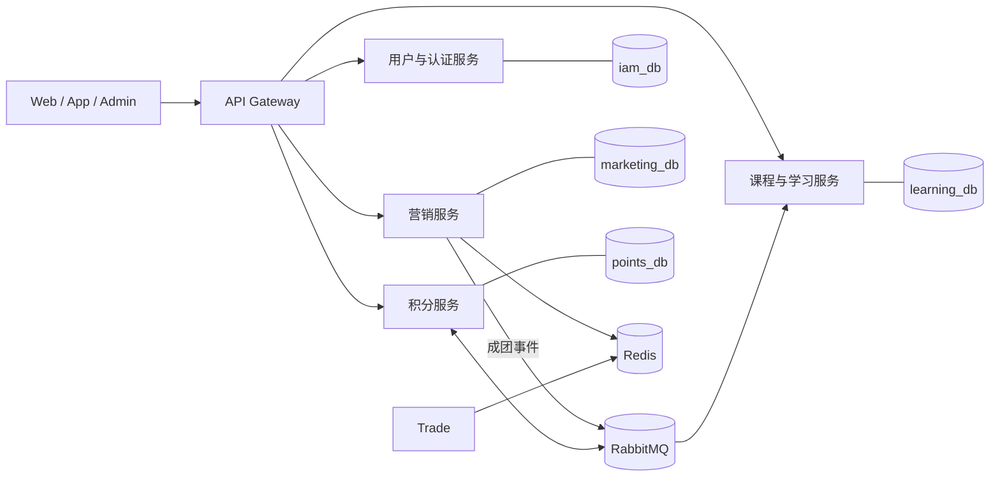

# 系统架构设计

## 1. 架构风格

采用业务能力驱动的微服务架构，服务内部使用传统三层架构。首轮优先实现简历中能够被验证的三项能力：知识付费拼团、积分赛季排名、分布式锁注解；其他服务只补齐业务闭环所需的最小接口。



图中是当前已实现的服务边界。课程、章节、Note、权益和视频进度首版归属同一个
`knowledge-learning` 服务，原因与未来拆分条件见 ADR-0010。

可复用技术组件统一由 `knowledge-components` 聚合管理。该模块自身仅为 Maven
聚合父模块，不承载运行时代码；对象存储位于 `knowledge-object-storage`，声明式
分布式锁位于 `knowledge-lock-spring-boot-starter`。部署脚本、中间件镜像和数据库
初始化继续保留在根目录 `infra`，不与 Java 技术组件混用。

## 2. 服务职责与数据所有权

| 服务 | 职责 | 拥有的数据 | 明确不负责 |
|---|---|---|---|
| gateway | 路由、认证入口、限流、请求追踪 | 无业务数据 | 业务授权、业务编排 |
| iam | 用户身份、登录、角色与基础权限 | 用户、凭证、角色 | 课程权益 |
| marketing | 拼团活动、团实例、参与资格、名额、首版交易订单与支付结果 | 活动、团、参与记录、订单、通知任务 | 课程内容、学习权益 |
| learning | 课程与章节、Note、课程权益、视频学习进度 | 课程、章节、Note、权益、进度 | 支付判断、营销规则 |
| points | 签到、积分账户、赛季榜单 | 积分流水、赛季 | 金额优惠核算 |
| community | 文章、评论、点赞 | 社区内容 | 课程主数据 |

## 3. 服务内部结构（业务域优先、域内传统分层）

```text
{domain}/controller   HTTP 接口、参数校验、协议转换
{domain}/service      业务编排、事务边界、状态迁移
{domain}/dao/mapper   MyBatis-Plus Mapper 与定制 SQL
{domain}/dao/model    数据库 DO，仅在 DAO/Service 内使用
{domain}/dto          接口输入或跨服务传输对象
{domain}/bo           Service 业务对象
{domain}/vo           Controller 对外展示对象
{domain}/converter    DO/DTO/BO/VO 显式转换
{domain}/rule         复杂校验规则和责任链节点
{domain}/mq           消息生产、消费与 EventDTO 适配
{domain}/job          调度任务入口
config                全服务共享的 Spring 配置
```

主要调用方向：

```text
domain.controller -> domain.service -> domain.dao.mapper -> database
                              |---> Redis
                              |---> RabbitMQ
                              |---> another-domain.service
```

复杂并不等于堆进一个 Service：规则校验放入责任链，状态迁移集中在状态服务/策略中，分布式锁等技术能力通过独立 Starter 提供。禁止 Controller 直接调用 Mapper，也禁止 Mapper 承载业务或远程调用。包结构采用 Package by Feature，避免全服务的 Controller、Service、Mapper 目录持续膨胀。

## 4. 调用策略

- 用户正在等待且必须立即获得结果时，使用同步 HTTP 调用。
- 状态传播、通知、积分、权益发放和统计默认使用异步事件。
- 同步调用必须设置连接与读取超时，不进行无限重试。
- 非幂等写请求不得由基础设施透明重试。
- 链路中同步服务跳数原则上不超过 3；超过时优先重新划分用例或异步化。

## 5. 部署拓扑

本地环境使用 Docker Compose 运行基础设施，业务服务可由 IDE 启动。每个服务独立端口、独立 schema、独立配置。生产化部署不是首轮目标，但所有服务应满足无状态部署要求，业务状态不得只保存在 JVM 内存。

## 6. 演进规则

- 新增微服务需要同时满足：独立业务能力、明确数据所有者、独立变更理由。
- 如果两个模块总是同步发布、共享事务且无法定义稳定契约，优先保持同一服务内模块化。
- 拆分前记录基线，拆分后验证延迟、故障面和运维成本是否可接受。
