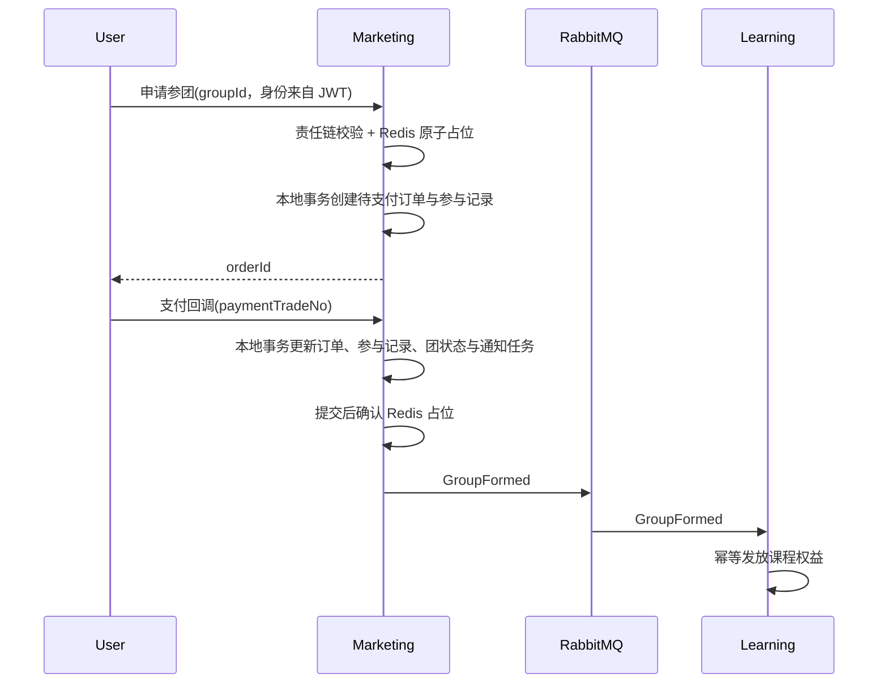

# 核心领域与一致性设计

## 1. 核心业务实体

### 拼团活动 `GroupActivity`

- 属性：活动 ID、课程商品 ID、开始/结束时间、成团人数、用户参与上限、活动状态、版本号。
- 不变量：只有已开启且在有效期内的活动可参与；成团人数至少为 2；活动结束后不可新增团。

### 拼团实例 `GroupOrder`

- 属性：团 ID、活动 ID、团长、目标人数、已确认人数、状态、过期时间、版本号。
- 状态：`FORMING -> FORMED`，或 `FORMING -> EXPIRED/CANCELLED`。
- 不变量：同一用户不能重复占用同一团名额；人数不能超过目标人数；已结束状态不可回退。

### 交易订单 `TradeOrder`

- 属性：订单 ID、用户 ID、课程 ID、活动/团 ID、金额快照、状态、过期时间、版本号。
- 状态：`PENDING_PAYMENT -> PAID -> FULFILLED`；未支付订单可进入 `CANCELLED/CLOSED`。
- 不变量：金额与商品/活动快照在创建后不可变化；支付成功不能被取消；同一用户对同一团不重复建单。

### 学习权益 `CourseEntitlement`

- 属性：用户 ID、课程 ID、来源类型、来源 ID、生效时间、失效时间、状态。
- 不变量：相同来源只能发放一次；权益发放失败可以安全重试。

### Note `Note`（第 5.1 轮已实现）

- 属性：笔记 ID、用户 ID、课程 ID、可选章节/视频 ID、笔记名称 `title`、正文、版本号、创建/更新时间。
- 名称规则：去除首尾空白后长度为 1—100 个字符；允许同一用户存在同名笔记，不把名称作为业务唯一键。
- 不变量：只有笔记所有者可查看、重命名、编辑或删除；重命名和正文编辑使用版本号防止多端覆盖。
- API 语义：创建时必须提供标题；`PATCH /api/learning/notes/{noteId}/title` 支持独立重命名，冲突返回 409。
- 权限语义：只有持有有效课程权益的用户可创建 Note；课程级 Note 不允许携带视频时间点。

## 2. 拼团责任链

参与拼团按以下顺序校验：

1. 请求合法性：JWT 用户和路径中的团 ID 完整且格式合法。
2. 活动有效性：状态与时间窗口有效。
3. 用户资格：未超活动参与次数，无风控阻断。
4. 团状态：仍在组团中且未过期。
5. 名额：当前确认及占位人数小于目标人数。
6. 价格快照：活动价格与订单请求一致。

责任链只负责规则判定，不直接写数据库、发送消息或调用支付。

## 3. 核心交易时序

## 4. 一致性边界

- 首版订单、参与记录、团状态和通知任务均由营销服务维护，并在一个本地事务中保持一致。
- 成团到下游权益发放采用可靠任务 + RabbitMQ 的最终一致性。
- Redis 占位用于降低竞争，数据库唯一约束和条件更新是最终防线。
- Outbox 发送器失败可重试；消费失败进入重试/死信；定时对账处理长期未收敛状态。

## 5. 失败场景与恢复

| 场景 | 预期行为 | 恢复手段 |
|---|---|---|
| 同一用户重复参团 | 返回该用户在该团的已有订单 | `(group_id, user_id)` 唯一索引 |
| 重复支付通知 | 不重复更新、不重复发事件 | 渠道流水唯一索引 + 状态条件更新 |
| 支付成功后 MQ 不可用 | 订单仍为已支付，事件待发送 | Outbox 重试 |
| 消费 `OrderPaid` 两次 | 团人数只确认一次 | 消费幂等 + 参与记录唯一索引 |
| 最后一名并发加入 | 只有一个请求成功占用最后名额 | Redis 原子占位 + DB 条件更新兜底 |
| 成团事件重复 | 权益只发放一次 | 权益业务唯一索引 |
| 服务在事务中崩溃 | 本地状态全部提交或全部回滚 | 数据库事务 |
| 占位后未支付 | 到期释放，不计入确认人数 | 延迟消息/定时扫描补偿 |

## 6. 对账任务

- 扫描已支付但长时间未确认拼团的订单。
- 扫描已成团但未发放权益的用户。
- 扫描已过期仍处于组团中的团实例。
- 对账只补齐可证明的目标状态，不盲目覆盖状态；每次修复记录原因、前后状态和关联 ID。
