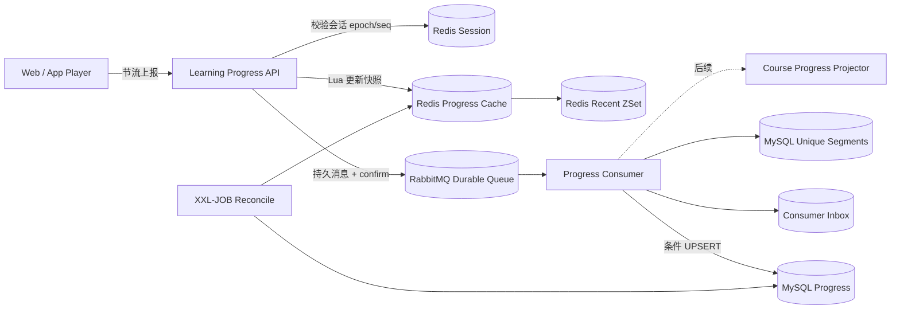

# 视频学习进度企业级设计

## 1. 设计目标

视频进度包含两种不同业务事实，必须分开：

1. **断点位置（resume position）**：用户下次从哪里继续播放，允许用户在当前会话中主动后退。
2. **学习完成度（learning completion）**：用户实际看过多少内容，不能因为拖到结尾就直接完成。

本方案支持：

- 跨设备断点续播。
- 暂停、退出、播放结束时及时保存。
- 播放过程中的低频心跳，降低写放大。
- 重复、乱序、离线补发和旧设备迟到事件。
- Redis 丢失后的数据库恢复。
- 真实观看区间累计和课程完成度计算。

不在本方案范围：视频转码、CDN、DRM、防录屏和严格考试防作弊。

## 2. 公开案例调研

### 2.1 Eyevinn：Redis 版 Continue Watching API

流媒体技术公司 Eyevinn 提供了一个开源示例：按 `userId + assetId` 写入秒级位置，并支持查询单个位置及按新近程度查询用户的全部观看记录。它证明 Redis 很适合承担低延迟的断点查询和最近观看排序，但该示例明确是简单实现，只有 Redis，缺少独立事实存储、事件去重和恢复链路，适合作为缓存模型参考，不直接作为生产数据方案。[Eyevinn Continue Watching API](https://github.com/Eyevinn/continue-watching-api)

### 2.2 Roku：发布方后端维护真实书签

Roku 的官方 Continue Watching 规范要求内容发布方自己的后端维护实际播放书签，因为内容可能跨 Web、移动端和 Roku 设备播放。Roku 建议在开始播放达到一定门槛后加入 Continue Watching，播放结束时更新位置，完成后移除；播放过程中不需要持续调用 Roku 的聚合接口。其条目包含 `contentId`、`lastInteractionTime`、`position` 和 `duration`，并按最近交互等信号排序。[Roku Continue Watching](https://developer.roku.com/dev/docs/continue-watching)

对本项目的启示：平台聚合列表和断点事实是两个层次；后端必须有自己的可靠事实源，客户端在关键生命周期事件主动上报。

### 2.3 Netflix：Continue Watching 不等于简单最大进度

Netflix 公开说明 Continue Watching 会使用最近观看、已观看比例、节目类型、设备与时间等特征排序，并指出“用户是否真的看完”并不简单，例如设备未关闭或用户睡着都会造成误判。[Netflix Technology Blog](https://medium.com/netflixtechblog/to-be-continued-helping-you-find-shows-to-continue-watching-on-7c0d8ee4dab6)

对本项目的启示：断点位置、完成状态和“继续学习”列表应是独立概念；不能只用 `position / duration` 一条规则覆盖全部语义。

### 2.4 Open edX：交互事件与聚合完成度分离

Open edX 定义了播放、暂停、停止、位置跳转等不同视频交互事件，暂停事件携带 `currentTime`；其完成度体系再把内容单元、章节和课程进度聚合成更高层事件。[Open edX 视频事件](https://docs.openedx.org/en/open-release-sumac.master/developers/references/internal_data_formats/tracking_logs/student_event_types.html)、[Open edX 完成度聚合](https://docs.openedx.org/projects/openedx-aspects/en/open-release-redwood.master/how-tos/xapi_transforms.html)

对本项目的启示：保留有语义的播放事件，使用异步投影形成视频、章节和课程完成度，避免接口直接同步重算整门课程。

## 3. 推荐总体架构



关键原则：

- RabbitMQ 的持久消息是高频上报进入服务端后的可靠缓冲。
- MySQL 是进度快照、状态与审计的事实源。
- Redis 只负责低延迟断点读取、活跃会话控制、观看区间和最近学习列表。
- MQ 发送使用 publisher confirm；确认失败向客户端返回可重试错误，不能返回假成功。
- 消费端按至少一次投递设计，数据库条件更新与 Inbox 去重共同抵御重复、乱序消息。

## 4. 客户端上报策略

### 4.1 上报时机

- 正常播放时每 **15 秒**上报一次，仅当有效播放位置发生变化。
- `pause`、`seeked`、`ended`、切换视频、退出播放器时立即上报。
- 页面进入后台时通过可靠退出请求尽力上报，但不能只依赖 `beforeunload`。
- 网络不可用时保存在客户端有限队列；恢复后按原 `sessionId + seq` 补发。
- 客户端队列必须限制数量和存活时间，例如最多 200 条、保留 24 小时。

浏览器原生 `timeupdate` 可能高频触发，只用于本地采样，不能每次直接请求服务端。

### 4.2 事件格式

```json
{
  "eventId": "01J...ULID",
  "videoId": "video-1001",
  "videoVersion": 3,
  "sessionId": "01J...ULID",
  "sessionEpoch": 42,
  "sequence": 18,
  "eventType": "HEARTBEAT",
  "positionMs": 305000,
  "durationMs": 1800000,
  "playedRanges": [[290000, 305000]],
  "clientOccurredAt": "2026-09-02T10:10:00Z",
  "playbackRate": 1.0
}
```

`userId` 从服务端认证上下文获得，不能相信客户端传入。服务端限制单次 `playedRanges` 增量不能明显超过真实经过时间乘播放倍速及容差。

## 5. 多设备与乱序规则

单纯按最大 `positionMs` 合并是错误的，因为用户可以主动回看；单纯按客户端时间覆盖也容易受到时钟漂移和离线迟到事件影响。

采用两级顺序：

1. 用户开始播放时调用 `POST /api/learning/videos/{videoId}/sessions`，服务端原子分配递增的 `sessionEpoch`。
2. 相同会话内只接受更大的 `sequence`。
3. 跨会话只允许更大的 `sessionEpoch` 更新断点位置；旧会话迟到事件可进入行为分析，但不能覆盖新会话的 resume position。
4. 当前会话允许位置后退，因此 resume position 取最新合法事件，不取历史最大值。
5. `maxPositionMs` 和已观看区间独立合并，仅用于统计和完成判定。

这样，新设备开始播放后，旧设备的离线事件不会把进度倒退；当前设备主动回看仍能正确保存。

## 6. Redis 数据模型

### 6.1 断点快照

```text
Key:  kw:learning:progress:{userId}:{videoId}:{videoVersion}
Type: Hash
TTL:  7 days，读取后续期，上限 30 days

resumePositionMs
maxPositionMs
durationMs
sessionEpoch
sequence
status
completionRate
updatedAt
```

通过 Lua 一次完成 epoch/sequence 比较、Hash 更新和 TTL 设置，避免并发的读改写窗口。

### 6.2 活跃播放会话

```text
Key:  kw:learning:session:{userId}:{videoId}
Type: Hash
TTL:  2 hours

sessionId
sessionEpoch
lastSequence
lastHeartbeatAt
```

创建新会话时使用 Redis `INCR` 生成 epoch。Redis 丢失时由数据库记录的最高 epoch 重新建立，epoch 生成需使用数据库区间预分配或带服务端时间前缀，避免重置后变小。

### 6.3 最近学习列表

```text
Key:    kw:learning:recent:{userId}
Type:   Sorted Set
Member: videoId:videoVersion
Score:  serverUpdatedAtEpochMs
```

只返回前 20～50 项并定期清理已完成/过期课程。Redis Sorted Set 的成员唯一且按 score 排序，适合最近学习列表，常用操作复杂度为 `O(log N)`；范围查询仍必须限制返回数量。[Redis Sorted Sets](https://redis.io/docs/latest/develop/data-types/sorted-sets/)

### 6.4 真实观看区间（首版落在 MySQL）

```text
Table:  lr_watched_segment
Unique: user_id + video_id + video_version + segment_index
Unit:   每条记录表示一个完整观看的 10 秒片段
```

播放器只报告从上一次心跳到当前的实际连续播放区间，拖动跳过的区间不置位。`BITCOUNT × 10 / duration` 得到近似观看比例。视频版本进入 Key，避免替换视频后继承旧完成度。

首版以数据库唯一键直接抵御重复消息，`COUNT × 10 / duration` 计算完成度；Redis Bitmap 可在真实压测证明数据库写放大成为瓶颈后再增加，不能先写进“已实现”口径。

## 7. MySQL 数据模型

### `lr_video_progress`

| 字段 | 说明 |
|---|---|
| user_id + video_id + video_version | 业务唯一键 |
| resume_position_ms | 最新合法会话断点 |
| max_position_ms | 历史最大播放位置，仅用于统计 |
| watched_seconds | 去重后的真实观看时长 |
| completion_rate | 0～10000，表示万分比 |
| status | NOT_STARTED / LEARNING / COMPLETED |
| last_session_epoch | 已接受的最高会话代次 |
| last_sequence | 当前代次最高序号 |
| last_event_id | 最近处理事件 |
| updated_at | 服务端更新时间 |
| version | 乐观锁版本 |

条件更新语义：只有 `(incomingEpoch > storedEpoch) OR (incomingEpoch = storedEpoch AND incomingSeq > storedSeq)` 才能更新断点；观看区间和事件 Inbox 仍可独立进行幂等合并。

### `lr_progress_event_inbox`

以 `consumer_name + event_id` 为唯一键，记录消费结果。它与进度更新处于同一数据库事务，事务成功后才确认 RabbitMQ 消息。

### `lr_watched_segment`

保存已完整观看的 10 秒片段，业务唯一键保证重复、重叠区间不会重复累计。

### `learning_course_progress`（后续）

保存课程级投影：已完成视频数、总视频数、完成比例和最后学习时间。它由视频完成度变化事件异步更新，不在每次心跳中同步遍历课程内容。

## 8. 读写流程

### 写入

1. 验证登录、课程权益、视频版本、位置范围和速率限制。
2. 检查 `sessionEpoch + sequence`；明显陈旧事件直接幂等返回当前状态。
3. 发布持久化 `VideoProgressReported` 消息并等待 publisher confirm。
4. 使用 Lua 更新 Redis 断点快照和最近学习 ZSet。
5. 返回服务端接受的 epoch、sequence 和 resume position。
6. 消费者在同一事务中幂等更新 MySQL 进度、Inbox 与观看片段，再修复 Redis 投影。

若步骤 3 成功、步骤 4 失败，消费者会从 MQ 重建 Redis；若客户端因响应丢失重试，`eventId` 与序号保证幂等。

### 读取

1. 读取 Redis 快照。
2. 未命中则读取 MySQL，并以短期互斥或随机过期时间回填缓存。
3. 数据库也没有记录时返回位置 0，而不是缓存空值过久。
4. 返回前把位置限制在 `[0, duration]`；接近结尾且状态已完成时按产品规则从 0 重播或播放下一节。

## 9. 完成判定

建议默认规则：

- 实际观看区间覆盖率达到 90%；或
- 播放到视频结尾且实际观看覆盖率达到 80%。

阈值属于课程策略，可配置但必须记录当时生效的策略版本。用户拖到最后一秒不能直接完成；重复观看不重复累计同一区间。

Continue Watching 列表规则与完成规则分离：

- 有效观看超过 60 秒或总时长 5% 后加入。
- 已完成、无权益或视频下架后移除。
- 用户可以显式从列表移除，但不删除学习审计记录。

## 10. 限流、容量与降级

- 客户端常规频率约每用户每视频 4 次/分钟；服务端允许暂停/拖动造成的小突发。
- 限流维度为用户、设备和 IP；超过限制返回明确可重试时间。
- MQ 不可用：写接口返回 503，客户端本地排队重试，不能只写 Redis 后返回成功。
- Redis 不可用：消息可靠入队后可返回“已接收”，读取暂时回源 MySQL；消费者稍后修复缓存。
- MySQL 不可用：MQ 削峰，消费者退避重试；积压量和最老消息年龄必须告警。
- 单用户热点通过 Key 分散天然隔离；课程级聚合不得在心跳请求中竞争同一课程行。

## 11. 可观测与告警

核心指标：

- 上报 QPS、接受/陈旧/重复/拒绝数量。
- MQ confirm 延迟、队列深度、最老消息年龄、死信数量。
- Redis 命中率、Lua 拒绝数、内存和 Key 数量。
- MySQL 条件更新失败、消费延迟、Inbox 增长速度。
- 跨设备会话切换次数、进度回退次数、完成度异常跳变。
- Redis 与 MySQL 抽样对账差异率。

告警必须携带 `eventId`、`userId`（脱敏）、`videoId`、`sessionEpoch` 和 `sequence`，便于重放与定位。

## 12. 验收用例

1. 同一事件发送 10 次，断点和观看时长只更新一次。
2. sequence 20 先于 sequence 19 到达，最终保留 sequence 20。
3. 新设备 epoch 11 播放后，旧设备 epoch 10 的离线事件不能覆盖断点。
4. 当前会话从 10 分钟回看至 5 分钟，断点更新为 5 分钟，最大位置仍为 10 分钟。
5. 直接拖到结尾不完成；真实观看达到阈值后完成。
6. Redis 全部清空，读取可回源 MySQL，后台可重建最近列表和活跃进度。
7. MQ confirm 失败时客户端收到可重试错误，恢复后补发不产生重复副作用。
8. RabbitMQ 重复投递和消费者重启不重复累计观看时长。
9. 替换视频并增加 `videoVersion` 后，不继承旧视频的完成度。
10. 课程包含 100 个视频时，单次心跳不扫描或锁定全部课程进度。
