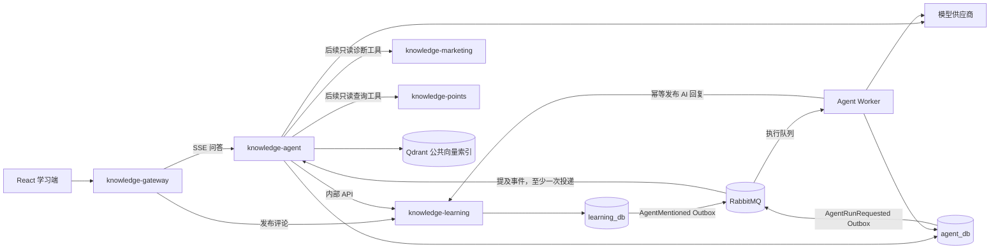
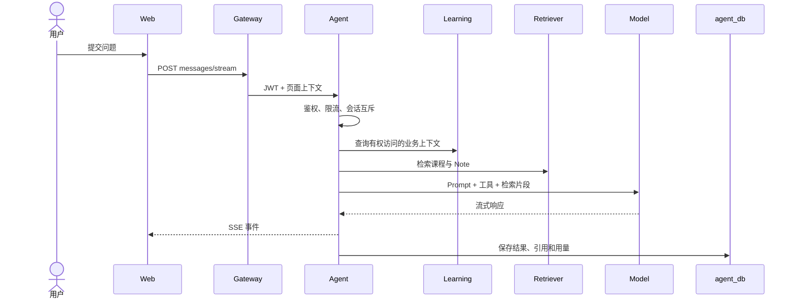
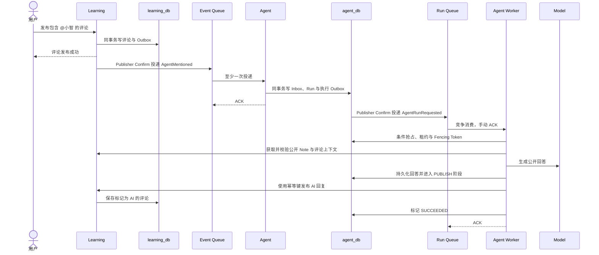

# 小智 AI Agent 初步设计

- 状态：开发中（无 RAG 问答原型与右侧学习端已落地，完整能力未验收）
- 日期：2026-09-17
- 对应轮次：5.8（开发中）
- 相关决策：`docs/adr/0014-xiaozhi-agent-service.md`、`docs/adr/0015-agent-run-dispatch-and-recovery.md`

## 1. 目标

在知识工坊现有课程、学习进度、Note 与评论能力之上增加“小智”AI 学习助手，首期包含两个入口：

1. 全局右侧“问小智”：根据当前页面、课程、章节、学习进度与用户有权访问的 Note 提供流式问答。
2. 公开 Note 评论区 `@小智`：用户明确提及时，基于公开 Note 和当前评论线程异步回复。

首期重点验证上下文感知问答、带来源回答、受控工具调用、异步可靠执行与权限隔离，不以“自主执行任意业务操作”为目标。

## 2. 范围边界

### 2.1 首期包含

- Java 17 + Spring Boot 独立服务 `knowledge-agent`。
- LangChain4j 作为模型、流式输出、工具调用与 RAG 编排框架。
- 右侧抽屉的 SSE 流式问答。
- 评论区 `@小智` 的 Outbox + RabbitMQ 异步回复。
- 已发布课程、章节和 PUBLIC Note 的检索与引用。
- 当前用户自己的课程进度和 Note 只读工具。
- 会话、消息、运行、工具调用、引用、模型与 Token 用量的持久化审计。
- 请求限流、超时、幂等、内容安全和资源级权限校验。

### 2.2 首期不包含

- 多 Agent 协作与自主任务规划。
- 自动支付、参团、发放权益、修改积分或订单状态。
- 模型直接访问业务数据库、Mapper、任意 URL 或执行 SQL。
- 私人 Note 进入公共向量索引。
- 模型训练、微调、OCR、音视频转写和复杂文档解析。
- 未经用户确认直接覆盖或发布 Note。

## 3. 服务边界与数据所有权

`knowledge-agent` 拥有：

- Agent 会话与消息；
- Agent 运行状态、错误与重试信息；
- 工具调用摘要与审计；
- 回答引用及其来源版本；
- Prompt 版本、模型标识和 Token 用量；
- Agent 消费幂等记录。

它不拥有课程、Note、评论、进度、订单、积分、权益和用户资料。这些数据继续由原服务管理，Agent 只能通过受鉴权的内部 API 或事件访问，不直接访问其他服务数据库。



## 4. 服务内部结构

服务继续采用业务域优先、域内传统分层：

```text
com.knowledge.agent
├── conversation  # 私人会话、消息和 SSE
├── mention       # @小智事件消费与公开回复
├── run           # 持久化状态机、执行分发、租约与恢复
├── retrieval     # 检索、权限过滤和引用组装
├── tool          # 有场景白名单的业务工具
├── model         # LangChain4j 适配和模型端口
├── prompt        # Prompt 模板及版本
├── safety        # 输入、输出和工具调用规则
└── config
```

业务层通过本项目定义的端口调用模型，避免 LangChain4j 类型扩散到 Controller、DAO 与业务契约：

```java
public interface AgentModelService {
    Flux<AgentChunkBO> stream(AgentRequestBO request);
    AgentAnswerBO generate(AgentRequestBO request);
}
```

LangChain4j 实现位于 `model` 域内。是否采用 `AI Services` 接口、低层模型 API 或两者组合，在原型验证后确定。

## 5. 右侧“问小智”

### 5.1 请求流程



### 5.2 初步外部契约

```text
POST /api/agent/conversations
GET  /api/agent/conversations?page=1&pageSize=20
GET  /api/agent/conversations/{conversationId}/messages
POST /api/agent/conversations/{conversationId}/messages/stream
POST /api/agent/runs/{runId}/cancel
```

消息请求包含客户端 UUID 幂等键、问题和页面上下文。课程、章节、视频、Note 等 ID 仅作为查询提示，服务端必须使用 JWT 身份重新校验可见性。

SSE 事件初步定义：

```text
run.started
answer.delta
citation.added
tool.started
tool.completed
answer.completed
answer.failed
```

不向用户输出模型内部思维过程，只展示回答、必要的工具执行状态与可验证引用。

## 6. 评论区 `@小智`

### 6.1 可靠执行流程



事件仅携带稳定 ID，不携带完整 Note 正文，避免消息过大、过期快照及私人内容泄漏。建议事件字段为：

```text
eventId, eventType, occurredAt, aggregateId, version,
noteId, commentId, parentCommentId, requesterId
```

AI 回复使用 `AGENT_COMMENT_REPLY:{sourceCommentId}` 作为业务幂等键，并由数据库唯一索引兜底。运行生命周期状态与执行阶段分开保存：状态为 `PENDING/RUNNING/RETRY_WAIT/SUCCEEDED/DEAD` 等，评论执行阶段为 `CONTEXT/GENERATE/PUBLISH`。模型结果在进入 `PUBLISH` 前先持久化，发布失败只重试发布，不重新调用模型。可恢复失败进入有界退避，超过上限进入死信和可观测 `DEAD` 状态；任何失败都不能影响用户原评论提交。

## 7. 工具与权限模型

首期按场景建立不同工具白名单。

私人问答可用：

- 查询当前用户课程与学习进度；
- 查询当前用户自己的 Note；
- 查询公开课程和 PUBLIC Note；
- 在用户确认后创建 Note 草稿。

公开评论可用：

- 查询当前 PUBLIC Note；
- 查询当前公开评论线程；
- 查询公开课程目录和公开知识库。

公开评论 Agent 不注册私人进度、私人 Note、订单、积分等工具。`userId`、角色和权限范围必须由 JWT 与服务端执行上下文注入，不能接受模型参数作为可信身份。

每次工具执行都由目标服务重新做资源级权限校验。工具只能调用目标服务 Service 暴露的内部接口，不得绕过目标服务访问 Mapper 或数据库。

## 8. RAG 初步设计

公共索引首期候选数据：

- 已发布课程简介；
- 已发布章节文本；
- 已授权使用的课程字幕；
- PUBLIC Note；
- 平台帮助文档。

公共索引不包含 PRIVATE/DRAFT Note、订单、用户资料和私人学习数据。个人 Note 通过实时权限查询注入当前请求上下文，不进入公共索引。

向量文档至少保存以下元数据：

```text
documentId, sourceType, sourceId, sourceVersion,
courseId, chapterId, visibility, ownerId,
contentHash, updatedAt
```

首期向量存储确定为 Qdrant，仅承载公共资料的稠密向量检索与元数据过滤；不是课程、Note 等业务事实源。以 `sourceType:sourceId:sourceVersion:chunkNo` 构造稳定业务分块键，再生成确定性 UUID 作为 Qdrant Point ID，原始分块键保存在 payload 中。内容更新使用幂等 upsert，删除事件删除对应分块。只为实际过滤字段创建 payload 索引，首批包括 `sourceType`、`sourceId`、`sourceVersion`、`courseId`、`chapterId`、`visibility` 与 `updatedAt`，最终以查询计划和评估集验证结果为准。

检索后仍需执行可见性校验。Embedding 采用阿里云百炼 `text-embedding-v4`，固定 1024 维；资料索引使用 `document` 类型、用户问题使用 `query` 类型。Markdown/章节语义切分参数、混合检索与重排方案均为待验证项；首期采用稠密向量 TopK 召回加元数据过滤，不提前引入 Elasticsearch、BM25 或 Reranker。

## 9. 数据模型草案

`agent_db` 首批候选表：

| 表 | 用途 | 关键约束 |
|---|---|---|
| `agent_conversation` | 会话与所属用户 | 用户只能访问自己的会话 |
| `agent_message` | 用户/助手消息 | `(conversation_id, client_request_id)` 唯一 |
| `agent_run` | 单次同步或异步运行、生命周期状态、阶段检查点、租约与执行版本 | 评论场景按来源评论唯一；状态迁移使用条件更新 |
| `agent_execution_outbox` | 将持久化 Run 可靠投递到执行队列 | `run_id` 与执行代次唯一 |
| `agent_tool_call` | 工具、耗时与结果摘要 | 不保存令牌和非必要敏感参数 |
| `agent_citation` | 回答引用与来源版本 | 可追溯到业务资源 |
| `agent_event_inbox` | MQ 消费幂等 | `(event_id, consumer)` 唯一 |

完整消息与运行记录以 MySQL 为事实源；LangChain4j Chat Memory 只负责挑选本轮模型上下文，不作为聊天历史事实源。

## 10. 并发、超时与失败恢复

- 同一 `conversationId` 同时只允许一个生成任务，避免 LangChain4j Chat Memory 并发损坏和回答交错。
- MySQL `agent_run` 是运行事实源，RabbitMQ 执行队列负责唤醒、削峰和多实例分发；不使用 Redis 锁决定任务所有权。
- Worker 通过数据库条件更新领取任务，记录 `leaseOwner`、`leaseUntil` 和递增的 `executionVersion`；所有阶段写入使用该版本作为 Fencing Token。
- 生产执行队列使用 Quorum Queue、持久化消息、Publisher Confirm、手动 ACK、有限 Prefetch 和 DLQ；RabbitMQ 4.1 使用 TTL 重试队列加 DLX 实现延迟退避。
- 生命周期状态按 `PENDING -> RUNNING -> SUCCEEDED` 推进，可恢复失败进入 `RETRY_WAIT`，不可恢复或超过上限进入 `DEAD`；评论执行阶段按 `CONTEXT -> GENERATE -> PUBLISH` 推进，回答在进入 `PUBLISH` 前持久化。
- 模型、Embedding 和内部 HTTP 调用必须在数据库短事务之外；抢占、检查点和条件状态迁移使用短事务。
- 低频 Reconciliation Job 恢复租约过期、长期未投递及已有持久化回答但未发布的运行。
- 同步问答超时后不透明重新生成，避免重复计费和非确定结果。
- 评论 Agent 依赖执行消息重投、消费幂等、运行状态机和发布评论幂等共同恢复，不能只依赖 Broker。
- 模型调用成功但持久化失败时，运行必须进入可识别的失败状态，不得把未审计回答标记为完成。
- SSE 断开只结束传输，不自动把模型运行标记为失败；显式取消或模型总超时才终止运行。

首期运行边界如下，需经测试调整：

| 环节 | 初始预算 |
|---|---:|
| 普通内部查询工具 | 1 秒 |
| RAG 检索 | 2 秒 |
| 首 Token | 10 秒 |
| 单次模型总运行 | 30 秒 |
| 单轮工具调用 | 最多 3 次 |
| 最大输入 / 输出 Token | 6,000 / 1,200 |
| 单次 / 单用户每日成本上限 | 0.05 元 / 2 元 |

## 11. 安全与治理

- 将系统指令、用户输入、检索资料和工具结果作为不同信任层处理。
- Note、评论和课程正文均视为不可信数据，其中的指令不得提升权限或改变工具白名单。
- 输入、输出与工具参数设置长度和数量上限。
- 写工具首期仅允许创建草稿，并要求用户确认；不开放资金、权益、积分和订单写操作。
- AI 评论显示“小智 · AI 学习助手”和“AI 生成”标识，并提供反馈或举报入口。
- 日志不记录完整 Prompt、令牌、模型密钥或不必要的个人数据。
- 保存 Prompt 版本、模型标识、Token 用量、工具摘要和引用，满足问题复现与成本分析。

## 12. 可观测性

至少监控：

- 活跃 SSE 连接数；
- 首 Token、完整回答和工具调用耗时；
- 模型错误率、超时率和取消率；
- 输入/输出 Token 与估算成本；
- RAG 召回耗时和无结果率；
- 工具调用成功率与权限拒绝数；
- 评论 Agent 队列积压、重试和死信数量；
- 各场景限流与会话冲突次数。

## 13. 分阶段落地

1. 建立内部契约与威胁模型；已确定 DeepSeek `deepseek-flash`、百炼 `text-embedding-v4`（1024 维）和 Qdrant。
2. 修复内部上下文资源校验和模型关闭时的服务启动，建立可执行的集成测试入口。
3. 创建统一 Run 状态机、执行 Outbox、RabbitMQ 执行队列、租约/Fencing Token、阶段重试和对账恢复。
4. 解耦 SSE 传输与模型运行，补齐超时、取消、最终结果查询和多轮 Memory。
5. 建立公开资料索引事件、语义切分、Qdrant upsert/delete 和带来源回答。
6. 接入经过鉴权的个人进度与个人 Note 只读工具，并按场景限制最多 3 次工具调用。
7. 增加内容安全、限流、成本控制、指标和故障演练。
8. 经用户确认后开放创建 Note 草稿，其他写工具继续后置。

## 14. 待确认问题

- 是否在固定评估集证明确有必要后引入关键词混合检索和 Reranker。
- 课程字幕或正文的来源、版权和更新机制。
- 评论区频率限制、单线程最大追问次数和失败展示方式。
- 引用粒度、答案质量评估集和上线阈值。
- `@小智` 解析规则、同名用户冲突与历史评论兼容方式。

本文固化实现决策及正在开发的边界，不代表完整能力已经实现或验收。当前已有无 RAG 流式问答、会话历史、评论 Outbox/消费幂等和实际回复原型；MySQL 状态机 + RabbitMQ 执行队列仍是待实现的目标方案。跨服务接口、事件字段和失败语义见 `docs/20-xiaozhi-agent-contract-and-prototype-plan.md`。
