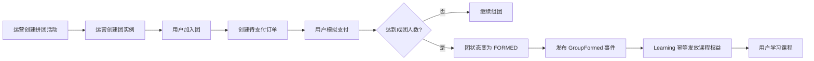
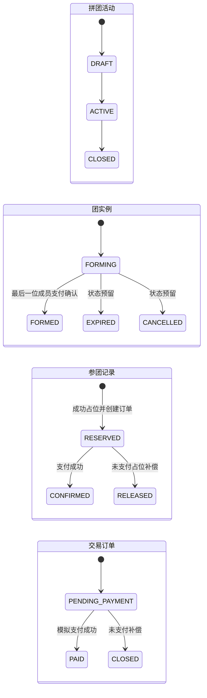
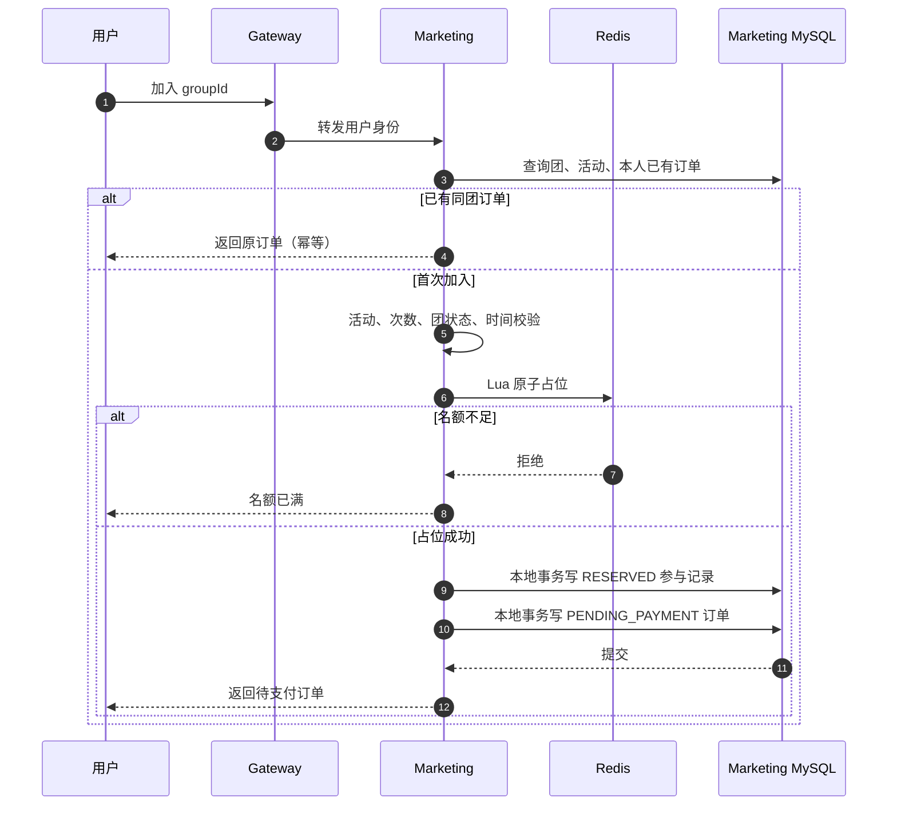
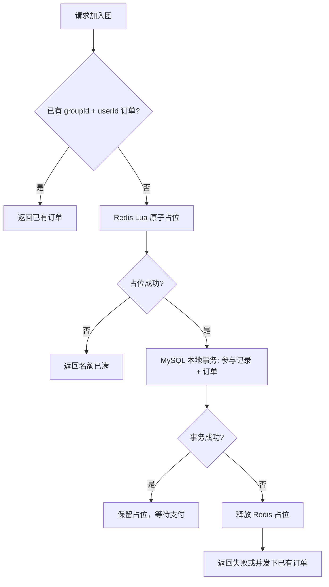
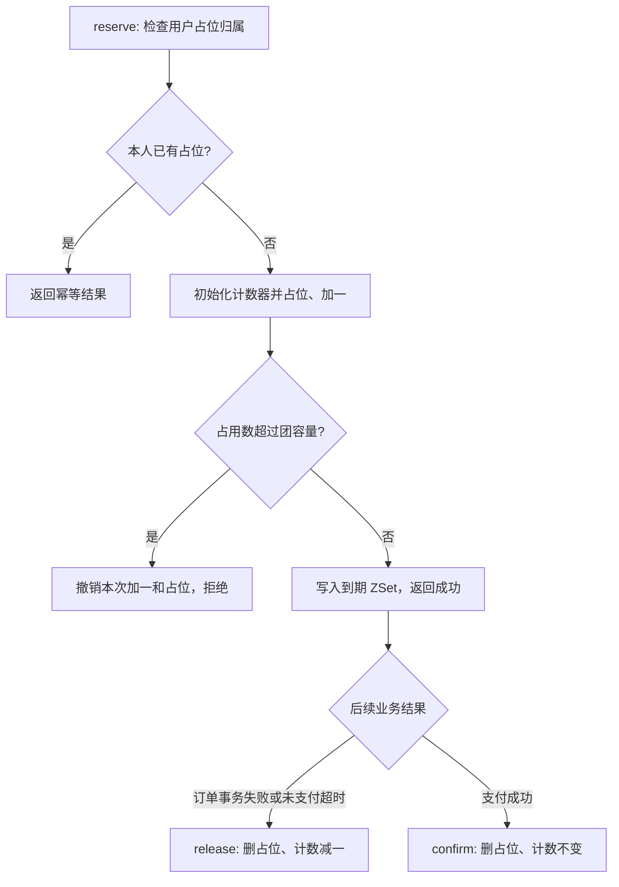
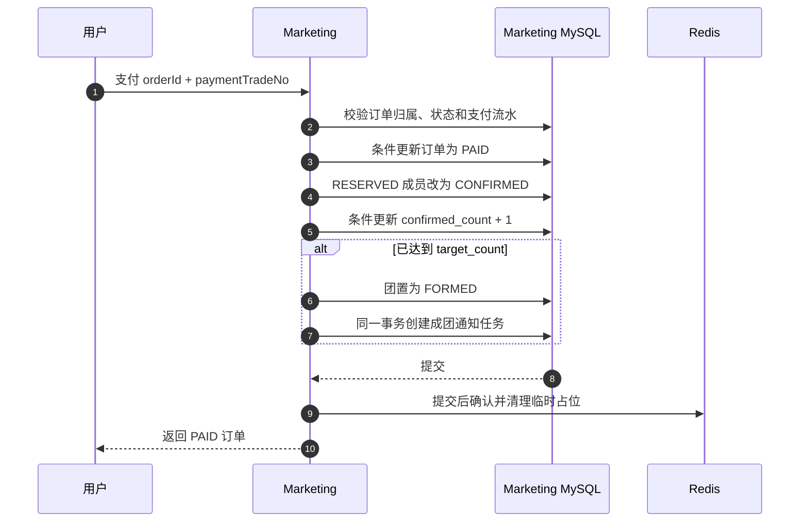
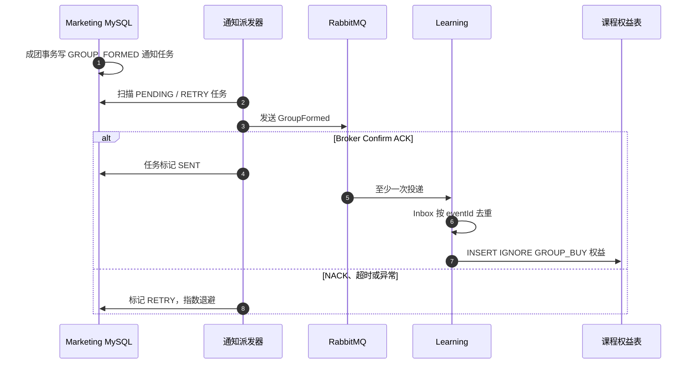
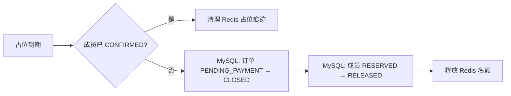

# 知识付费拼团业务链路

本文以当前代码实现为准，说明“用户购买课程”如何经过参团、模拟支付、成团和权益发放形成闭环。

它是对[核心领域与一致性设计](../03-domain-and-consistency.md)的业务视角补充；接口、表结构和自动化验证以营销、学习服务代码及[第 2 轮验收记录](../acceptance/round-2-marketing.md)为准。

## 1. 业务目标与范围

用户以拼团价购买课程。用户加入的是一个已存在的团实例；完成支付后只代表其参团资格已确认。只有团达到目标人数，所有已确认成员才获得课程学习权益。



当前首期边界：

- 团实例由运营侧创建，普通用户不能自行开团。
- 支付为模拟支付接口，不接入微信、支付宝等真实渠道。
- 课程权益只在成团后发放，支付成功但未成团时不能学习。
- 不包含退款、优惠券、发票、真实支付对账等交易能力。

## 2. 服务边界

| 服务 | 拥有的数据与职责 | 不负责的内容 |
| --- | --- | --- |
| `knowledge-marketing` | 活动、团、参与记录、交易订单、支付状态、成团通知任务 | 课程内容与课程权益 |
| `knowledge-learning` | 课程、章节、视频、课程权益、学习进度 | 订单、支付、拼团名额 |
| `knowledge-iam` | 用户身份与角色 | 拼团规则和订单 |

Marketing 与 Learning 不共享数据库。Marketing 成团后只发送领域事件，Learning 根据事件创建权益。

## 3. 核心对象与状态



| 对象 | 关键字段/约束 |
| --- | --- |
| `GroupActivity` | 课程 ID、拼团价、有效期、目标人数、每用户参与上限；只有 `ACTIVE` 且处于时间窗口内可加入。 |
| `GroupOrder` | 团长、目标人数、已确认人数、过期时间；只有 `FORMING` 团可加入。 |
| `GroupParticipant` | 用户在团中的状态；`(group_id, user_id)` 唯一。 |
| `TradeOrder` | 订单金额为活动价格快照；`(group_id, user_id)` 唯一，支付流水号唯一。 |
| `CourseEntitlement` | 用户可学习课程的事实；按权益来源与用户、课程组合幂等。 |

`EXPIRED`、`CANCELLED` 和订单 `CANCELLED` 已是枚举状态，但当前尚未实现完整的团到期状态流转和已支付未成团退款流程；不能将其描述为已具备的能力。

## 4. 用户参团链路

用户通过网关调用：

```http
POST /api/marketing/groups/{groupId}/join
Authorization: Bearer <用户 JWT>
```

服务端从 JWT 的 `UserContext` 取得用户 ID，不接受客户端伪造的用户 ID。



### 4.1 参团规则

责任链按以下顺序判断：

1. 活动状态必须为 `ACTIVE`。
2. 当前时间位于活动开始和结束时间之间。
3. 用户在活动中的 `RESERVED + CONFIRMED` 次数未达上限。
4. 团状态为 `FORMING`，且团未到期。
5. 数据库已确认人数尚未达到目标人数。
6. Redis 占位后的“已确认人数 + 临时占位人数”仍不超过容量。

价格不由前端提交。创建订单时，Marketing 将活动 `price_cents` 写入订单，形成不可随活动后续修改而变化的订单金额快照。

### 4.2 幂等与并发控制

同一用户重复点击参团，不会生成多张订单：先查已有订单，数据库唯一键仍作为并发兜底。并发下若多个请求同时到达，Redis Lua 脚本以原子方式增加占位计数；数据库事务失败则立即释放刚取得的占位。



Redis 仅是并发协调和短期占位工具，不是订单事实源。最终防线是 MySQL 的唯一约束与支付时的条件更新。

### 4.3 Lua 如何管理名额

`RedisSlotReservationService` 从 `knowledge-marketing/src/main/resources/redis/group-buy/` 加载 `reserve.lua`、`release.lua` 和 `confirm.lua`，分别完成占位、释放和确认。对同一个团，脚本操作以下 Key：

| Key | 类型 | 作用 |
| --- | --- | --- |
| `kw:marketing:group:{groupId}:occupied` | String 计数器 | 记录已确认成员与临时占位合计占用的名额。首次使用时，以数据库的 `confirmed_count` 初始化。 |
| `kw:marketing:group:{groupId}:reservation:{userId}` | String，值为 `userId` | 留存该用户的占位归属，防止重复占位及误释放。 |
| `kw:marketing:group:{groupId}:reservation-expiry` | ZSet | 成员为 `userId`，分数为占位到期的毫秒时间戳，供补偿任务扫描。 |

这些 Key 都包含 `{groupId}`，因此同团脚本的多个 Key 在 Redis Cluster 中落在同一哈希槽。占位成功后，服务还会把 `groupId` 加入全局的 `reservation-expiry-groups` 集合，让补偿任务找到待扫描的团；这个集合的更新发生在 Lua 脚本之外，写入失败时服务会释放本次新占位并报错。

| 操作 | Lua 中的原子步骤 | 返回或结果 |
| --- | --- | --- |
| `reserve` | 先查用户占位 Key；若已由本人占位，直接返回幂等结果。计数器不存在时用数据库已确认人数初始化，然后写入占位归属、将计数加一；超过团容量就撤销本次加一和占位，否则把用户及到期时间写入 ZSet。 | 新占位成功、重复占位，或名额不足。 |
| `release` | 仅当占位 Key 的值是当前 `userId` 时，删除该 Key、从 ZSet 移除用户，并在计数大于零时减一。 | 数据库写入失败或未支付超时后归还名额；重复释放不会再次减一。 |
| `confirm` | 仅当占位归属匹配时，删除占位 Key 并从 ZSet 移除用户。 | 支付成功后清理临时占位痕迹；**不减少计数**，因为该名额已变成数据库中的已确认成员。 |



业务占位期限为 **30 分钟**，由 ZSet 的到期分数和补偿任务共同执行。计数器、占位归属 Key 与 ZSet 的 Redis 过期时间为 **2 天**，用于给延迟运行的补偿任务留下处理依据；不能把 2 天当作允许支付的时间。Lua 保证单次 Redis 操作原子执行，跨 Redis 与 MySQL 的失败恢复仍由本地事务、释放脚本和补偿任务负责（见第 7 节）。

## 5. 支付、确认与成团

用户调用：

```http
POST /api/marketing/orders/{orderId}/pay
Content-Type: application/json

{
  "paymentTradeNo": "模拟支付渠道流水号"
}
```

当前接口会确认订单所属用户，不能支付他人的订单。相同支付流水对已支付订单重复调用时返回已有结果；不同流水尝试支付同一订单会冲突。



团人数递增使用条件 SQL：只有团仍处于 `FORMING` 且 `confirmed_count < target_count` 时才允许加一。最后一名支付者将团原子切换为 `FORMED`，从而避免超卖或重复成团。

## 6. 成团后的权益发放

成团事务不能直接依赖 RabbitMQ 或 Learning 实时可用。Marketing 在订单、参与记录、团状态更新的同一 MySQL 事务内创建 `notification_task`，再由后台任务可靠投递。



### 6.1 通知任务状态与重试

| 状态 | 含义 |
| --- | --- |
| `PENDING` | 成团事务已提交，等待首次投递。 |
| `SENT` | RabbitMQ 已确认接收。 |
| `RETRY` | 投递失败，等待下次自动重试。 |
| `DEAD` | 达到最大重试次数，等待运营人工重试。 |

派发器每 5 秒扫描，等待 Broker Confirm 最多 5 秒；失败后采用有上限的指数退避，最多 10 次，最大延迟 10 分钟。运营端可以查询并人工重试 `RETRY` 或 `DEAD` 任务。

Learning 消费事件时，先写消费 Inbox；同一 `eventId` 第二次到达会直接返回。每位已确认用户写入一条 `source_type=GROUP_BUY`、`source_id=groupId` 的课程权益，重复插入由唯一键忽略。因此消息至少一次投递不会导致重复授课。

## 7. 超时与补偿

未支付的 Redis 临时占位有效期为 30 分钟。补偿任务每 30 秒扫描到期占位：



若数据库事务写失败，参团服务会立即回滚刚抢到的 Redis 名额。若支付后 Redis 清理失败，支付和成团的 MySQL 事实不会回滚；补偿任务会在后续扫描中恢复 Redis 协调状态。

## 8. 一致性承诺与非承诺

当前系统承诺：

- 同一用户在同一团只产生一条参与记录和一张订单。
- 固定并发验证中，100 个请求竞争 10 个名额时只成功 10 个，不超卖。
- Redis 占位成功后若本地事务失败，会释放占位。
- 成团后 RabbitMQ 暂不可用不会撤销支付或成团；通知任务会重试。
- `GroupFormed` 重复投递不会重复创建课程权益。

当前系统不承诺：

- 跨 Marketing、RabbitMQ、Learning 的端到端 exactly-once。
- 真实支付渠道的验签、退款、清结算与对账。
- 已支付但最终未成团时的自动退款。
- 连续压力下的生产容量或固定 RPS。

## 9. 关键实现位置

| 业务环节 | 主要实现 |
| --- | --- |
| 加团入口 | `knowledge-marketing/.../groupbuy/controller/GroupPurchaseController` |
| 参团编排 | `GroupPurchaseService`、`GroupJoinTransactionService` |
| 资格校验 | `groupbuy/rule` 下的责任链规则 |
| 并发占位 | `RedisSlotReservationService` 与 `src/main/resources/redis/group-buy/` 下的 Lua 脚本 |
| 支付与成团 | `PaymentSettlementService`、`GroupOrderMapper.confirmOne` |
| 未支付补偿 | `ReservationCompensationService`、`ReservationCompensationJob` |
| 可靠投递 | `NotificationTaskDispatcher`、`NotificationCompensationJob` |
| 权益消费 | `knowledge-learning/.../entitlement/mq/GroupFormedConsumer`、`EntitlementService` |

## 10. 验证证据

营销模块的自动化验收覆盖：100 请求竞争 10 个名额、重复参团幂等、数据库失败释放 Redis 占位、Redis 不可用时拒绝开启交易写入、RabbitMQ 投递失败后的重试和空库 Flyway 迁移。详细结果见[第 2 轮拼团验收记录](../acceptance/round-2-marketing.md)。
